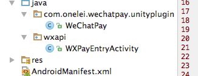

# wechatPay-unity
wechatPay plugin for unity.

## NOTICE
if package name is "com.onelei.wechatpay.unityplugin" , then the "WXPayEntryActivity.java" file must below "wxapi" folder.
The Activity is used to receive the payment result callback.    

    


## android function
```
  public void weChatPay(String appId,String partnerId,String prepayId,String nonceStr,
                          String timeStamp,String packageValue,String sign,String extData)
    {
        PayReq req = new PayReq();
        req.appId			= appId;
        req.partnerId		= partnerId;
        req.prepayId		= prepayId;
        req.nonceStr		= nonceStr;
        req.timeStamp		= timeStamp;
        req.packageValue	= packageValue;
        req.sign			= sign;
        req.extData			= extData;
        // 在支付之前，如果应用没有注册到微信，应该先调用IWXMsg.registerApp将应用注册到微信
        api = WXAPIFactory.createWXAPI(this, APPID,false);
        api.registerApp(APPID);
        api.sendReq(req);
    }
    
    
     /**
     * 得到支付结果回调
     */
    @Override
    public void onResp(BaseResp resp) {
        int errCode = resp.errCode;
        switch (errCode) {
            case -2:
                Toast.makeText(this,"支付取消",Toast.LENGTH_LONG).show();
                break;
            default:
                Toast.makeText(this,"支付错误,errCode "+errCode,Toast.LENGTH_LONG).show();
                break;
        }
        UnityPlayer.UnitySendMessage("SDKManager","PayCallBack",""+errCode);

        finish();//这里重要，如果没有 finish（）；将留在微信支付后的界面.


    }
```

## CSharp

```
private void WeChatPayAndroid(string appid, string partnerid, string prepayid, string noncestr, string timestamp, string package, string sign, string extraData)
    {
#if UNITY_ANDROID 
        var ja = new AndroidJavaClass("com.unity3d.player.UnityPlayer");
        var jo = ja.GetStatic<AndroidJavaObject>("currentActivity");
        jo.Call("weChatPay", appid, partnerid, prepayid, noncestr, timestamp, package, sign, extraData);
#endif
    }
    
    void PayCallBack(string errCode)
    {

    }
```

## AndroidManifest.xml 

```
 <!-- wechat所需的权限 -->
    <uses-permission android:name="android.permission.INTERNET" />
    <uses-permission android:name="android.permission.MODIFY_AUDIO_SETTINGS"/>
    <uses-permission android:name="android.permission.WRITE_EXTERNAL_STORAGE"/>
```

```
 <!-- WeChat pay -->
        <activity
            android:name="com.onelei.wechatpay.unityplugin.wxapi.WXPayEntryActivity"
            android:exported="true"
            android:launchMode="singleTop">

            <intent-filter>
                <action android:name="android.intent.action.VIEW"/>
                <category android:name="android.intent.category.DEFAULT"/>
                <data android:scheme="112233"/>
            </intent-filter>
        </activity>
```
